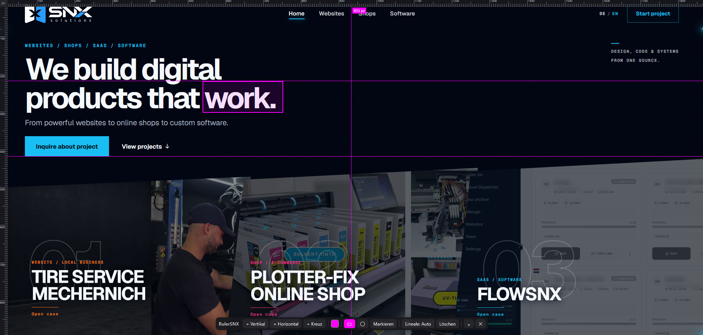

<div align="center">


# RulerSNX

**Illustrator-style ruler and draggable guide lines over any website.
Check optical axes, alignment and spacing while you build.**


[Firefox Add-on](https://addons.mozilla.org/de/firefox/addon/rulersnx-ruler-guides/) · [GitHub repository](https://github.com/senexsnx/rulersnx)

</div>

---

## Why RulerSNX?

You build a page, you look at it in the browser, and you are not quite sure. Is that
headline actually centered, or just close? Do the card edges line up? Does the vertical
rhythm hold across sections?

In Illustrator or InDesign you would pull a guide off the ruler and hold it against the
layout. RulerSNX puts that same move in the browser.

Pull magenta guide lines off the on-screen rulers and drop them on any element. You are
measuring the real rendered page at whatever viewport size you like, mobile emulation
included. Misaligned edges and off-center headings stop being a hunch. You do not have to
screenshot anything into a design tool or go digging through the box model in dev tools.

The second use is pointing. Draw a rectangle or circle around a region, screenshot it, send
it. It saves a paragraph of explaining which element you mean when you are talking to a
colleague or pasting the image into a chat.

Built for front-end devs and web designers, and for anyone who needs to show someone else
what is out of line.

---

## Screenshots

Checking alignment, with guides pulled across a three-column layout to verify the axes:


Flagging a bug, with a rectangle marker on a real layout error where a word overflows into
the next column:


> Open [`demo/index.html`](demo/index.html) in your browser for a playground to try it on.

---

## Related project: CalendarSNX

CalendarSNX is the companion Adobe InDesign JSX script from SNX Solutions. It creates
photo calendars with reusable layouts, themes, holidays and presets. The current script
and its full documentation live in the separate [CalendarSNX repository](https://github.com/senexsnx/CalendarSNX).

The latest InDesign examples are included here as a reference for the wider SNX toolset:


More CalendarSNX screenshots are available in [`docs/calendarSNX`](docs/calendarSNX/).

---

## Features

- Rulers along the top and left edge with a live px scale.
- Guides pulled out the Illustrator way: drag down from the top ruler for a horizontal
  guide, drag right from the left ruler for a vertical one.
- Magenta by default, colour freely changeable.
- Drag to reposition, with a live px label on the guide.
- Click a guide to select it, then `Entf` / `Delete` to remove it. Double-clicking it or
  dragging it back into the ruler works too.
- Region markers: draw a rectangle (default) or circle over any area to point at it. Pick
  the shape in the toolbar, then draw with `Shift` + drag on the page, or arm the
  `Markieren` button and drag normally. Markers select, move and delete like guides do.
- Rulers auto-hide and only appear when the cursor reaches the top or left edge, so they
  never cover your content. That matters most in narrow layouts. The `Lineale` button
  cycles through `Auto`, `An` and `Aus`.
- Guides are fixed to the viewport and stay put while you scroll, so you can follow one
  optical axis down a long page.
- Everything is saved per hostname and comes back on reload.
- The overlay is toggled from the RulerSNX popup. The current Firefox release does not provide
  a working keyboard shortcut, so use the popup controls to activate it.
- No network access, no host permissions and no data collection. RulerSNX runs on a page
  only after you click its icon and choose an action in the popup, and only on that tab. The overlay
  renders in a Shadow DOM so it cannot clash with the page's own CSS.

---

## Install (unpacked / developer)

This release is packaged for Firefox using a Manifest V3 background event page.

### Chrome / Edge

Run `npm run build:chrome` to generate `chrome-artifacts/rulersnx-chrome-<version>.zip`
and the unpacked `dist/chrome` directory. This build uses a Manifest V3 service worker
and requires Chromium 102 or later. In `chrome://extensions` or `edge://extensions`, enable
developer mode, choose **Load unpacked**, and select `dist/chrome`. The same ZIP is used
for Chrome Web Store and Microsoft Edge Add-ons submissions. The root manifest remains
Firefox-specific.

### Safari

The current Chromium package can be prepared for Safari with `npm run build:safari`,
which writes `safari-artifacts/rulersnx-safari-<version>.zip`. Safari requires Apple's
Safari Web Extension Packager and an Apple Developer Program account for signing and
App Store Connect submission; the package is intended for that final conversion step.

### Firefox

1. Open `about:debugging#/runtime/this-firefox`.
2. Click `Load Temporary Add-on…` and pick `manifest.json`.
3. That is it. Temporary add-ons disappear on restart. A permanent install needs the add-on
   signed via [addons.mozilla.org](https://addons.mozilla.org) — see
   [`docs/AMO-SUBMISSION.md`](docs/AMO-SUBMISSION.md) for the release checklist.

Firefox 140 or later on desktop. Firefox for Android is not supported.

> **First run: open a normal website first.** Browsers do not let extensions run on internal
> pages, which includes the Firefox and Chrome start page, anything under `about:` or
> `chrome://`, and the add-on stores. If nothing happens when you click `Aktivieren`, you are
> on such a page. Go to any real site, your own or `example.com`, and try again.

---

## Usage

| Action | How |
|---|---|
| Create a guide | Drag out of the top ruler (horizontal) or left ruler (vertical) |
| Create at center | Toolbar: `+ Vertikal` / `+ Horizontal` / `+ Kreuz` |
| Move a guide | Drag it; the label shows the exact px |
| Select a guide | Click it; it highlights and glows |
| Delete selected | `Entf` / `Delete` |
| Delete a guide | Double-click it, or drag it back into the ruler |
| Pick marker shape | Toolbar: `▭` rectangle (default) or `◯` circle |
| Draw a marker | `Shift` + drag on the page, or arm `Markieren` then drag |
| Move or delete a marker | Drag it; select and press `Entf`, or double-click |
| Rulers mode | `Lineale` button, cycling `Auto`, `An`, `Aus` |
| Change colour | Colour swatch in the toolbar |
| Clear everything | `Löschen` |
| Toggle overlay | Toolbar icon or popup |
| Deselect | `Esc` |

---

## How it works

The whole overlay lives in a Shadow DOM attached to `<html>`, so the page's styles cannot
leak in and RulerSNX styles cannot leak out.

Rulers are drawn on a `<canvas>`, which keeps them crisp on HiDPI screens. Guides are
lightweight fixed-position elements moved with CSS transforms.

In `Auto` mode the rulers stay hidden until the cursor enters the top or left edge zone. You
reach for the ruler exactly when you want to pull a guide, and the rest of the time the
content stays visible and clickable.

Guides and settings are persisted in the extension's own `storage.local`, under a key per
hostname (`rulersnx:…`), so state is separate for every site and comes back the next time
you switch the overlay on there. Nothing is written into the sites you measure.

The engine is not a declared content script. Clicking the icon and using the popup grants
`activeTab` for that one tab, and only then does the background page inject `toolbar.js` and
`guides.js` into it. Both files no-op if they are already there, so switching the overlay on
and off costs nothing. The extension never talks to the network.

---

## Privacy and permissions

RulerSNX is a local drawing tool. It does not collect, transmit or sell any data. The
manifest says so formally, with `data_collection_permissions: { "required": ["none"] }`,
which is what Firefox shows you in the install prompt.

It makes no network requests at all, so nothing you view or draw leaves your machine. There
is no analytics and no telemetry. There is no remote code either: everything ships inside
the extension and nothing is fetched or `eval`'d at runtime, which Manifest V3 forbids
anyway.

Three permissions, no host permissions:

| Permission | Why |
|---|---|
| `activeTab` | Draw the overlay on the tab you are looking at after popup activation; it is gone again when that tab navigates |
| `scripting` | Inject the ruler engine into that one tab at that moment |
| `storage` | Remember your guides, markers and colour per hostname, inside the extension |

There is no `<all_urls>` and no `host_permissions` entry, so RulerSNX has no standing access
to any site. The background event page coordinates popup commands. After activation, the injected
engine handles pointer and keyboard events to control the overlay; it does not read page
text or form values. The browser controls the lifetime of temporary active-tab access.

What it stores is your guide and marker coordinates, the colour and the toolbar state, in
`storage.local`. Up to 1.1.0 that state sat in the visited site's own `localStorage`, which
meant every site you measured kept a `rulersnx:` key that the site itself could read. Since
1.2.0 the state lives in the extension, and the first activation on a site moves the old key
out and deletes it.

## Mobile view in the devtools

RulerSNX notices touch simulation in the responsive design mode by itself and adapts as
soon as the first finger pointer shows up. No reload needed.

Tap the `px` corner at the top left to bring the rulers in. There is no hover without a
mouse, so the corner grip takes over showing and hiding them.

The grab strip on a guide grows from 11px to 44px while the visible line stays 1px thin, so
you can actually hit one with a finger. The toolbar collapses to a grip in the bottom right
and expands again when you switch back to a mouse.

Guides keep their absolute position when you change the viewport width. Anything outside
the current width is hidden and comes back unchanged when you switch back.

With a mouse, everything behaves the way it did in 1.0.0.

---

## Development and tests

The engine has no runtime dependencies. The test suite drives the real engine in a headless
DOM (jsdom) and covers creating, dragging, selecting and deleting, colour, persistence and
restore, the auto-hide rulers, and the touch and responsive-mode behaviour.

```bash
npm install    # dev-only: installs jsdom and web-ext
npm test       # 195 assertions, headless
npm run lint   # addons-linter — the same validator AMO runs on upload
npm run build  # web-ext-artifacts/rulersnx_ruler_guides-<version>.zip
npm run verify # tests + lint, the gate before a release
```

---

## Project structure

```
manifest.json        Manifest V3, temporary activeTab access (Firefox)
src/background.js    Event page: routes popup commands
src/exec.js          Inject-and-run helper shared by the background page and the popup
src/toolbar.js       The floating control bar and its collapsed grip
src/guides.js        The engine: rulers, guides, drag, select, auto-hide, persistence
src/popup.html/.js   Toolbar popup
icons/               Toolbar icons
demo/index.html      Standalone demo / playground
docs/AMO-SUBMISSION.md  Store listing copy, reviewer notes, release checklist
test/guides.test.js  Headless jsdom suite for the engine
test/exec.test.js    Headless suite for the injection path
web-ext-config.cjs   What ships in the signed package
```

---

## Roadmap

- Snapping to element edges and to other guides
- A mode where guides scroll with the document, in document coordinates
- Distance readout between two guides
- English UI / localization
- Signed builds for the Chrome Web Store and Edge Add-ons

---

## License

[MIT](LICENSE) © senex

Screenshot with RulerSNX enabled on a live layout:



