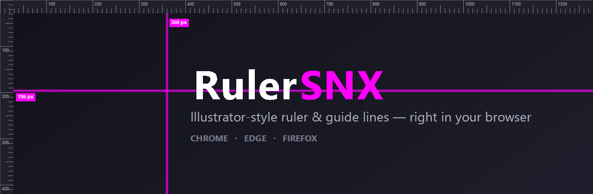
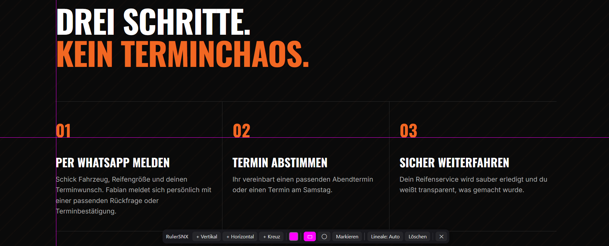
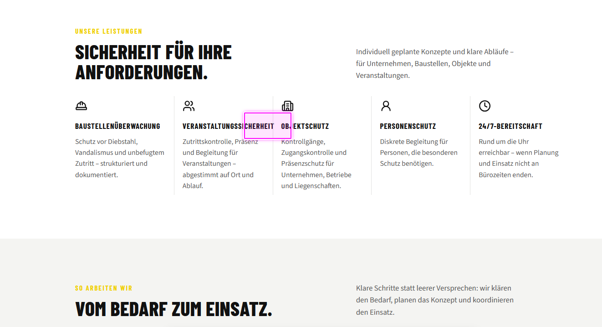

<div align="center">



# RulerSNX

**Illustrator-style ruler & draggable guide lines over any website —
verify optical axes, alignment and spacing while you build.**


</div>

---

## Why RulerSNX?

When you build websites, you check them in the browser — but *is that headline really
centered? Do the card edges line up? Is the vertical rhythm consistent across sections?*

In **Illustrator** or **InDesign** you'd just pull a guide off the ruler and eyeball it
against your layout. RulerSNX brings that exact muscle memory to the browser. It does two
things:

**1. Align better & catch mistakes.**
Pull **magenta guide lines** off on-screen rulers, drop them onto any element, and verify
**optical axes, alignment and spacing** on the real, rendered page — at any viewport size,
including mobile emulation. Misaligned edges, off-center headings and broken vertical rhythm
jump right out. No screenshots into a design tool, no dev-tools box-model hunting.

**2. Point people at the right spot.**
Draw a **rectangle or circle** around any region to mark it, then screenshot and share it.
Perfect for telling a **colleague, a client, or an AI** *“look here — fix this”* without
long explanations. The marker frames exactly the place you mean.

**Made for:** front-end devs, web designers, and anyone who needs things to *line up* — or
needs to *show* someone else where they don't.

---

## Screenshots

**Check alignment** — magenta guides pulled across a three-column layout to verify the axes line up:



**Flag a bug** — a rectangle marker highlights a real layout error (a word overflowing into the
next column), ready to screenshot and send to a colleague, client or AI:



> Want to try it yourself? Open [`demo/index.html`](demo/index.html) in your browser for a live playground.

---

## Features

- 📐 **Rulers** along the top and left edge with a live px scale.
- 🎯 **Pull out guides** like in Illustrator/InDesign — drag down from the top ruler for a
  horizontal guide, drag right from the left ruler for a vertical one.
- 💗 **Magenta by default**, colour freely changeable.
- ✋ **Drag to reposition** with a live px position label.
- 🖱️ **Click to select** a guide (it highlights), then press **`Entf` / `Delete`** to remove it.
- ↩️ **Delete** also by double-clicking a guide or dragging it back into the ruler.
- 🟪 **Mark a spot** — draw a **rectangle** (default) or **circle** over any region to point a
  colleague or an AI at exactly the right place. Pick the shape in the toolbar, then draw with
  **Shift + drag** on the page (or arm the **Markieren** button and just drag). Markers are
  selectable, movable and deletable just like guides.
- 🫥 **Rulers auto-hide** and only appear when the cursor reaches the top/left edge — so they
  **never cover your content**, which matters a lot in narrow/mobile layouts. The **Lineale**
  button cycles *Auto → An (always on) → Aus*.
- 📌 **Fixed to the viewport** — guides stay put while you scroll, so you can verify the same
  optical axis all the way down a long page.
- 💾 **Saved per hostname** — your guides come back on reload.
- ⌨️ **`Alt + G`** toggles the overlay anywhere.
- 🔒 **Zero network access, no extra permissions**, everything rendered in a Shadow DOM so it
  can't clash with the page's own CSS.

---

## Install (unpacked / developer)

RulerSNX is a single Manifest V3 codebase that runs on all three browsers.

### Chrome / Edge
1. Open `chrome://extensions` (or `edge://extensions`).
2. Enable **Developer mode** (top-right).
3. Click **Load unpacked** and select this project folder (the one with `manifest.json`).
4. Pin the **RulerSNX** icon, open any website, click it → **Aktivieren** (or press `Alt + G`).

### Firefox
1. Open `about:debugging#/runtime/this-firefox`.
2. Click **Load Temporary Add-on…** and pick `manifest.json`.
3. Done. *(Temporary add-ons are removed on restart. For a permanent install the add-on must
   be signed via [addons.mozilla.org](https://addons.mozilla.org).)*

> ⚠️ **First run — open a normal website first.** Browsers don't allow extensions to run on
> internal pages: the Firefox/Chrome **start page**, `about:…`, `chrome://…` and the add-on
> stores. If nothing happens when you click **Aktivieren**, you're on such a page — just go to
> any real site (your own, or `example.com`) and click it again (or press **`Alt + G`**).

---

## Usage

| Action | How |
|---|---|
| Create a guide | Drag out of the top ruler (horizontal) or left ruler (vertical) |
| Create at center | Toolbar: **+ Vertikal** / **+ Horizontal** / **+ Kreuz** |
| Move a guide | Drag it; the label shows the exact px |
| Select a guide | Click it (it highlights + glows) |
| Delete selected | **`Entf` / `Delete`** key |
| Delete a guide | Double-click it, or drag it back into the ruler |
| Pick marker shape | Toolbar: **▭** rectangle (default) / **◯** circle |
| Draw a marker | **Shift + drag** on the page, or arm **Markieren** then drag |
| Move / delete a marker | Drag it; select + **`Entf`**, or double-click |
| Rulers mode | **Lineale** button: *Auto → An → Aus* |
| Change colour | Colour swatch in the toolbar |
| Clear everything | **Löschen** |
| Toggle overlay | Toolbar icon, the popup, or **`Alt + G`** |
| Deselect | **`Esc`** |

---

## How it works

- The whole overlay lives in a **Shadow DOM** attached to `<html>`, so the page's styles
  can't leak in and RulerSNX styles can't leak out.
- Rulers are drawn on a `<canvas>` (crisp on HiDPI); guides are lightweight fixed-position
  elements moved with CSS transforms.
- **In `Auto` mode**, rulers are hidden until the cursor enters the top/left edge zone — you
  reach for the ruler exactly when you want to pull a guide, and the content stays fully
  visible and clickable the rest of the time.
- Guides + settings are persisted in `localStorage`, namespaced per hostname (`rulersnx:…`).
- **No permissions** are requested beyond running a content script on the current page, and
  it never talks to the network.

---

## Privacy & permissions

RulerSNX is a local drawing tool — it does **not** collect, transmit or sell any data.

- 🚫 **No network requests.** The extension never contacts any server; nothing you view or
  draw ever leaves your machine.
- 🚫 **No analytics, no tracking, no telemetry.**
- 🚫 **No remote code** — everything ships inside the extension; nothing is fetched or
  `eval`'d at runtime (Manifest V3 forbids remote code anyway).
- 💾 **What it stores:** only your guide/marker coordinates and colour, saved locally
  (`localStorage`, namespaced per hostname) so they return on reload.
- 🌐 **Why it can run on all sites:** as a layout tool it has to draw its overlay on whatever
  page you're checking, so its content script matches `<all_urls>`. It only reads
  pointer/keyboard input for drawing — **it does not read the page's content.** A
  least-privilege `activeTab` mode (access only when you click the icon) is on the roadmap.

---

## Development & tests

The engine is dependency-free at runtime. The test suite drives the real engine in a headless
DOM (jsdom) and exercises every interaction — creating, dragging, selecting, deleting,
colour, persistence/restore, and the auto-hide rulers.

```bash
npm install   # dev-only: installs jsdom
npm test      # 52 assertions, headless
```

---

## Project structure

```
manifest.json        Manifest V3 (Chromium + Firefox via browser_specific_settings)
src/toolbar.js       The floating control bar and its collapsed grip
src/guides.js        The engine — rulers, guides, drag, select, auto-hide, persistence
src/content.js       Content script: popup/hotkey bridge to the engine
src/popup.html/.js   Toolbar popup
icons/               Toolbar icons
demo/index.html      Standalone demo / playground
docs/banner.png      README banner
test/guides.test.js  Headless jsdom test suite
```

---

## Roadmap

- Snapping to element edges & to other guides
- "Guides scroll with the document" mode (document coordinates)
- Distance readout between two guides
- English UI / localization
- Least-privilege **`activeTab`** mode (drop the broad `<all_urls>` host permission)
- Signed builds for the Chrome Web Store, Edge Add-ons & AMO

---

## Mobile view in the devtools

RulerSNX detects touch simulation in the responsive design mode on its own and
adapts as soon as the first finger pointer shows up — no reload needed.

- **Reveal the rulers:** tap the `px` corner at the top left. There is no hover
  without a mouse, so the corner grip takes over showing and hiding them.
- **Grabbing guides:** the invisible grab strip grows from 11px to 44px while
  the visible line stays 1px thin.
- **Toolbar:** collapses to a grip in the bottom right on touch and expands
  again when you switch back to a mouse.
- **Changing viewport width:** guides keep their absolute position. Anything
  outside the current width is hidden and comes back unchanged when you switch
  back.

With a mouse everything behaves exactly as it did in 1.0.0.

---

## License

[MIT](LICENSE) © senex
